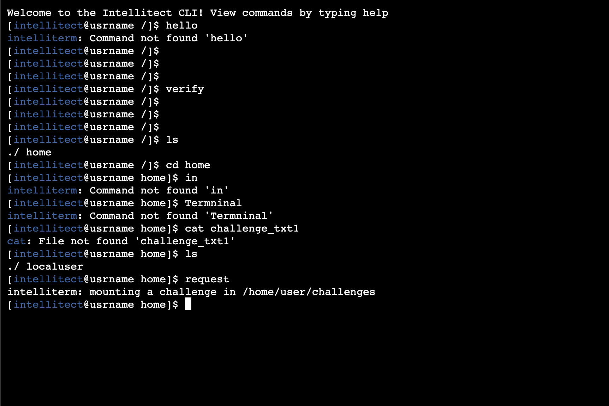

<a name="readme-top"></a>
<div align="center">

[](https://github.com/IntelliTect/IntellitectTerminal/actions/workflows/Build-Test-And-Deploy.yml)
</div>
<!-- PROJECT LOGO -->
<br />
<div align="center">
  <a href="https://console.intellitect.com">
    
  </a>

  <h3 align="center">IntelliTerminal</h3>

  <p align="center">
    An awesome README template to jumpstart your projects!
    <br />
    <br />
    <a href="https://console.intellitect.com">View Console</a>
    ·
    <a href="https://github.com/IntelliTect/IntellitectTerminal/issues">Report Bug/Feature</a>
    ·
    <a href="https://github.com/IntelliTect/IntellitectTerminal/files/9295965/presentation.pptx">Powerpoint Presentation</a>
  </p>
</div>

<!-- TABLE OF CONTENTS -->
<details>
  <summary>Table of Contents</summary>
  <ol>
    <li>
      <a href="#about-the-project">About The Project</a>
      <ul>
        <li><a href="#built-with">Built With</a></li>
      </ul>
    </li>
    <li>
      <a href="#getting-started">Getting Started</a>
      <ul>
        <li><a href="#prerequisites">Prerequisites</a></li>
        <li><a href="#installation">Installation</a></li>
      </ul>
    </li>
    <li><a href="#license">License</a></li>
  </ol>
</details>

<!-- ABOUT THE PROJECT -->
## About The Project

[](https://console.intellitect.com)

The IntelliTect terminal was the winning project created for the 2022 Intelliect Intern Hackathon. The project was inspired by Google Foobar. Intellitect Terminal, or IntelliTerm is a virtual bash-like command line interface for a pseudo filesystem. On the IntelliTerm, the user can request text based challenges such as coding problems, which will be appended to a directory on the filesystem. After navigating to that directory, the user can view the challenge, and respond with a text document or an executable python file. Once the response is ready, they can then submit the file via the submit command, sending it to the server. To review if the answer was marked as correct or incorrect, the command verify can be ran. Once verify gives a satisfying output, another challenge can be submitted. When all three challenges are complete, an email will be sent to the recruiting department. This CLI-challenge was created to be used by IntelliTect to recruit more developers. The prompt to access the CLI will appear randomly on the IntelliTect website, allowing the user to begin the challenge.

<p align="right">(<a href="#readme-top">back to top</a>)</p>

### Built With

* Vue.js with typescript
* Asp.net
* [Coalesce](https://github.com/IntelliTect/Coalesce)
* [XTerm.js](https://xtermjs.org/)

<p align="right">(<a href="#readme-top">back to top</a>)</p>

<!-- GETTING STARTED -->
## Getting Started

### Prerequisites

To run this locally, you will need

* node/npm
* dotnet
* Visual Studio (optional)
* Sql server

### Installation

1. Clone the repo
   ```sh
   git clone https://github.com/IntelliTect/IntellitectTerminal.git
   ```
2. Cd into Web
   ```sh
   cd IntellitectTerminal.Web/
   ```
   
3. Install NPM packages (inside IntellitectTerminal.Web directory)
   ```sh
   npm ci
   ```

4. Build and run from root directory
   ```js
   dotnet run
   ```

5. Open Web Browser
   ```js
   localhost:3000
   ```

<p align="right">(<a href="#readme-top">back to top</a>)</p>

<!-- USAGE EXAMPLES -->
## Usage

_For more documentation on coalese, please refer to the [Coalesce Documentation](https://intellitect.github.io/Coalesce/) and [XTerm Documentation](https://xtermjs.org/docs/)_

<p align="right">(<a href="#readme-top">back to top</a>)</p>

<!-- LICENSE -->
## License

Distributed under the MIT License. See `LICENSE.txt` for more information.

<p align="right">(<a href="#readme-top">back to top</a>)</p>
